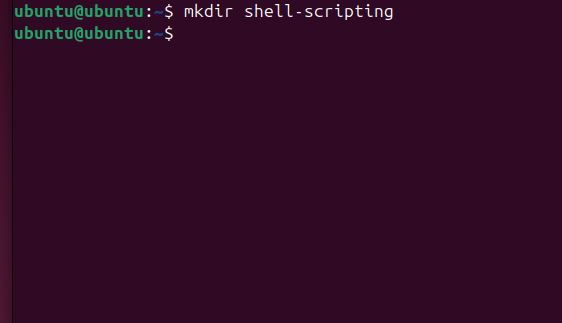
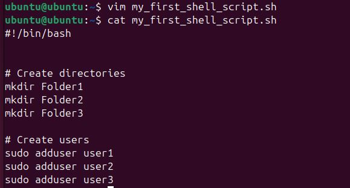
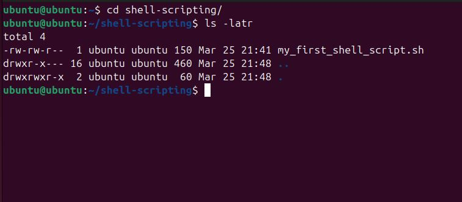

# Linux-Shell-Scripting

## Project Review

Linux shell scripting is a powerful tool that automates repetitive tasks, enhances system administration, and improves workflow efficiency. 
A shell script is a text file containing a series of commands that the shell executes sequentially. These scripts can automate tasks such as file manipulation, system monitoring, and software deployment, improving efficiency and reliability.

## Shell Environments

The following are the everal shell environments are available in Linux, each with unique features:

Bash: This is the most commonly used shell, known for its scripting capabilities and backward compatibility with the Bourne shell.

Zsh: It is an extended version of Bash with improved customization and interactive features.

Ksh: This offers advanced scripting functionalities and performance improvements over Bash.

Fish: This focuses on usability with features like syntax highlighting and auto-suggestions.

## Shebang Line (#!/bin/bash)

This is usually at the beginning of every shell script which helps to specify the interpreter to execute the script. 

## Project Task

### Step 1: Create a folder on an ubuntu and name it shell-scripting

'mkdir shell-scripting'

### Step 2: Using vim editor, create a file called 'my_first_shell_script.sh'

'vim my_first_shell_script.sh'

### Step 3: Type the shell script given and save it

i = to activate the insert mode.
:wq = to save and exit vim.

